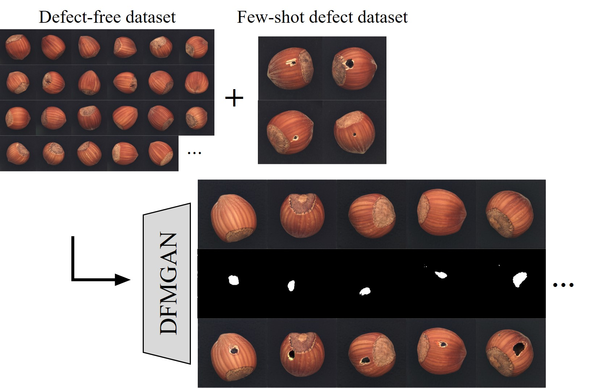

# Defect-aware Feature Manipulation GAN



This repository is the official implementation of the following paper:

> **Few-Shot Defect Image Generation via Defect-Aware Feature Manipulation**<br>
> [Yuxuan Duan](https://github.com/Ldhlwh), [Yan Hong](https://github.com/hy-zpg), [Li Niu](http://www.ustcnewly.com/), [Liqing Zhang](https://bcmi.sjtu.edu.cn/~zhangliqing/)<br>
> The 37th AAAI Conference on Artificial Intelligence (AAAI 23)
> 
> > **Abstract**
> > <font size=3> *The performances of defect inspection have been severely hindered by insufficient defect images in industries, which can be alleviated by generating more samples as data augmentation. We propose the first defect image generation method in the challenging few-shot cases. Given just a handful of defect images and relatively more defect-free ones, our goal is to augment the dataset with new defect images. Our method consists of two training stages. First, we train a data-efficient StyleGAN2 on defect-free images as the backbone. Second, we attach defect-aware residual blocks to the backbone, which learn to produce reasonable defect masks and accordingly manipulate the features within the masked regions by training the added modules on limited defect images. Extensive experiments on MVTec AD dataset not only validate the effectiveness of our method in generating realistic and diverse defect images, but also manifest the benefits it brings to downstream defect inspection tasks.*</font>


## Getting Started

- This repository is based on the official NVIDIA implementaion of [StyleGAN2-ADA](https://github.com/NVlabs/stylegan2-ada-pytorch). Follow the [requirements](https://github.com/NVlabs/stylegan2-ada-pytorch#requirements) of it before the steps below. (Windows and Docker are not supported.)
- Additional python libraries: ```pip install scipy psutil lpips tensorboard```.
- Clone the repository:
    ```shell
    git clone https://github.com/Ldhlwh/DFMGAN.git
    cd DFMGAN
    ```
    
## Dataset

- Download the MVTec Anomaly Detection (MVTec AD) dataset from [here](https://www.mvtec.com/company/research/datasets/mvtec-ad/) and unzip the archive files under ```./data```. (If you wish to try your own datasets, organize the defect-free images, defect images and the corresponding masks in a similar way.)
- Preprocess the dataset images into zip files for easy StyleGAN loading: (*e.g.* object category *hazelnut*, defect category *hole*)
    ```shell
    # Defect-free dataset for Stage 1
    python dataset_tool.py --source ./data/hazelnut/train/good \
        --dest ./data/hazelnut_good.zip \
        --width 256 --height 256
    
    # Defect image & mask dataset for Stage 2
    python dataset_tool.py --source ./data/hazelnut/test/hole \
        --source-mask /path/to/hazelnut/ground_truth/hole \
        --dest ./data/hazelnut_hole_mask.zip --width 256 --height 256
    ```
    
## Stage 1: Pretrain

- Pretrain a StyleGAN2 model on defect-free images, using the default configuration ```auto```: (*e.g.* object category *hazelnut*)
    ```shell
    python train.py --data ./data/hazelnut_good.zip \
        --outdir runs/hazelnut_good \
        --gpus 2 --kimg 3000    # You may try using 1, 2, 4 or 8 GPUs
    
    # If training for 3000 kimgs are not enough, you may resume the pretraining by
    python train.py --data ./data/hazelnut_good.zip \
        --outdir runs/hazelnut_good \
        --gpus 2 --kimg 3000 --resume runs/hazelnut_good/path/to/the/latest/model.pkl
    ```
- Check the qualitative & quantitative results under ```./runs/hazelnut_good/*```. Chose a good model for the transfer in Stage 2. You may optionally make a copy as ```./pkls/hazelnut_good.pkl``` for easy loading.

## Stage 2: Transfer

- Transfer the pretrained model to defect images with the defect-aware feature manipulation process: (*e.g.* object category *hazelnut*, defect category *hole*)
    ```shell
    python train.py --data ./data/hazelnut_hole_mask.zip \
        --outdir runs/hazelnut_hole --resume pkls/hazelnut_good.pkl \
        --gpus 2 --kimg 400 --snap 10 --transfer res_block_match_dis
        
    # You may also try different values for the following settings
    # --gpus: number of GPUs to be used
    # --lambda-ms: weight for the mode seeking loss
    # --dmatch-scale: the number of base channel/max channel of D_match
    ```
- The above process will by default compute FID@5k, KID@5k and Clustered LPIPS@1k on-the-fly per ```--snap``` ticks (*i.e.* $4 \times$```--snap``` kimgs). You may alter the metric list with ```--metrics```.
- Check the qualitative & quantitative results under ```./runs/hazelnut_hole/*```. You may optionally make a copy of a good model as ```./pkls/hazelnut_hole.pkl``` for easy loading.

## Inference: Defect Image Generation

- Generate 10 random defect images: (*e.g.* object category *hazelnut*, defect category *hole*)
    ```shell
    python generate.py --network pkls/hazelnut_hole.pkl \
        --output gen_img/hazelnut_hole
        
    # You may also try different values for the following settings
    # --seeds: specify the random seeds to be used
    # --num: number of generated images (only when --seeds is unspecified)
    # --gen-good: (flag) generate defect-free images along
    # --gen-mask: (flag) generate masks along
    ```
- Or, if you just wish to have a glimpse of the performance of a model, run the following command:
    ```shell
    python generate.py --network runs/hazelnut_hole/path/to/a/model.pkl --cmp
    ```
     to generate triplets of defect-free image, mask and defect image like Fig. 4 under the same directory with ```model.pkl```, named ```cmp<kimg>.png```.
     

## Citation
If DFMGAN is helpful to your research, please cite our paper:
```

```

### Acknowledgements

- The work was supported by the National Science Foundation of China (62076162), and the Shanghai Municipal Science and Technology Major/Key Project, China (2021SHZDZX0102, 20511100300).
- This repository have used codes from [StyleGAN-ADA](https://github.com/NVlabs/stylegan2-ada-pytorch) and [LPIPS](https://github.com/richzhang/PerceptualSimilarity).
